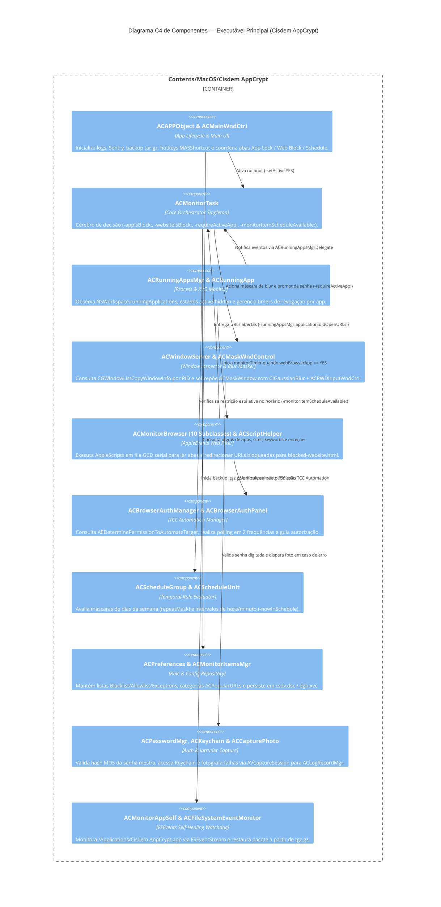

# Diagrama C4 — Nível 3: Componentes Internos do Binário Principal

> Gerado pelo agente **Architect** (`doc_level = detalhado`, 🟢 CONFIRMADO).

```mermaid
C4Component
    title Diagrama C4 de Componentes — Executável Principal (Cisdem AppCrypt)

    Container_Boundary(main_macho, "Contents/MacOS/Cisdem AppCrypt") {
        Component(app_object, "ACAPPObject & ACMainWndCtrl", "App Lifecycle & Main UI", "Inicializa logs, Sentry, backup tar.gz, hotkeys MASShortcut e coordena abas App Lock / Web Block / Schedule.")
        Component(monitor_task, "ACMonitorTask", "Core Orchestrator Singleton", "Cérebro de decisão (-appIsBlock:, -websiteIsBlock:, -requireActiveApp:, -monitorItemScheduleAvailable:).")
        Component(running_apps_mgr, "ACRunningAppsMgr & ACRunningApp", "Process & KVO Monitor", "Observa NSWorkspace.runningApplications, estados active/hidden e gerencia timers de revogação por app.")
        Component(window_mask_engine, "ACWindowServer & ACMaskWndControl", "Window Inspector & Blur Masker", "Consulta CGWindowListCopyWindowInfo por PID e sobrepõe ACMaskWindow com CIGaussianBlur + ACPWDInputWndCtrl.")
        Component(browser_engine, "ACMonitorBrowser (10 Subclasses) & ACScriptHelper", "AppleEvents Web Filter", "Executa AppleScripts em fila GCD serial para ler abas e redirecionar URLs bloqueadas para blocked-website.html.")
        Component(browser_auth_mgr, "ACBrowserAuthManager & ACBrowserAuthPanel", "TCC Automation Manager", "Consulta AEDeterminePermissionToAutomateTarget, realiza polling em 2 frequências e guia autorização.")
        Component(schedule_engine, "ACScheduleGroup & ACScheduleUnit", "Temporal Rule Evaluator", "Avalia máscaras de dias da semana (repeatMask) e intervalos de hora/minuto (-nowInSchedule).")
        Component(items_mgr, "ACPreferences & ACMonitorItemsMgr", "Rule & Config Repository", "Mantém listas Blacklist/Allowlist/Exceptions, categorias ACPopularURLs e persiste em csdv.dsc / dgh.xvc.")
        Component(security_mgr, "ACPasswordMgr, ACKeychain & ACCapturePhoto", "Auth & Intruder Capture", "Valida hash MD5 da senha mestra, acessa Keychain e fotografa falhas via AVCaptureSession para ACLogRecordMgr.")
        Component(self_defense, "ACMonitorAppSelf & ACFileSystemEventMonitor", "FSEvents Self-Healing Watchdog", "Monitora /Applications/Cisdem AppCrypt.app via FSEventStream e restaura pacote a partir de tgz.gz.")
    }

    Rel(app_object, monitor_task, "Ativa no boot (-setActive:YES)")
    Rel(running_apps_mgr, monitor_task, "Notifica eventos via ACRunningAppsMgrDelegate")
    Rel(monitor_task, items_mgr, "Consulta regras de apps, sites, keywords e exceções")
    Rel(monitor_task, schedule_engine, "Verifica se restrição está ativa no horário (-monitorItemScheduleAvailable:)")
    Rel(monitor_task, window_mask_engine, "Aciona máscara de blur e prompt de senha (-requireActiveApp:)")
    Rel(window_mask_engine, security_mgr, "Valida senha digitada e dispara foto em caso de erro")
    Rel(running_apps_mgr, browser_engine, "Inicia monitorTimer quando webBrowserApp == YES")
    Rel(browser_engine, monitor_task, "Entrega URLs abertas (-runningAppsMgr:application:didOpenURLs:)")
    Rel(browser_engine, browser_auth_mgr, "Verifica e solicita permissão TCC Automation")
    Rel(app_object, self_defense, "Inicia backup .tgz.gz e monitoramento FSEvents")
```
