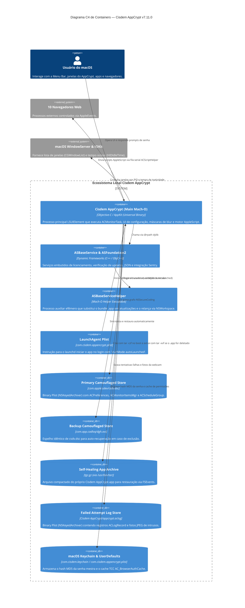

# Diagrama C4 — Nível 2: Containers e Armazenamento

> Gerado pelo agente **Architect** (`doc_level = detalhado`, 🟢 CONFIRMADO).

```mermaid
C4Container
    title Diagrama C4 de Containers — Cisdem AppCrypt v7.11.0

    Person(user, "Usuário do macOS", "Interage com a Menu Bar, janelas do AppCrypt, apps e navegadores.")

    System_Boundary(appcrypt_boundary, "Ecossistema Local Cisdem AppCrypt") {
        Container(main_app, "Cisdem AppCrypt (Main Mach-O)", "Objective-C / AppKit (Universal Binary)", "Processo principal LSUIElement que executa ACMonitorTask, UI de configuração, máscaras de blur e motor AppleScript.")
        Container(base_service_fw, "ASBaseService & ASFoundation2", "Dynamic Frameworks (C++ / ObjC++)", "Serviços embutidos de licenciamento, verificação de updates, JSON e integração Sentry.")
        Container(update_helper, "ASBaseServiceHelper", "Mach-O Helper Executable", "Processo auxiliar efêmero que substitui o bundle .app em atualizações e o relança via NSWorkspace.")
        Container(launch_agent, "LaunchAgent Plist", "com.cisdem.appencrypt.plist", "Instrução para o launchd iniciar o app no login com '-runMode autoLaunched'.")

        ContainerDb(primary_store, "Primary Camouflaged Store", "com.apple.sdev/csdv.dsc", "Binary Plist (NSKeyedArchiver) com ACPreferences, ACMonitorItemsMgr e ACScheduleGroup.")
        ContainerDb(backup_store, "Backup Camouflaged Store", "com.app.cadlvq/dgh.xvc", "Espelho idêntico de csdv.dsc para auto-recuperação em caso de exclusão.")
        ContainerDb(self_tar_backup, "Self-Healing App Archive", "tgz.gz (via /usr/bin/tar)", "Arquivo compactado do próprio Cisdem AppCrypt.app para restauração via FSEvents.")
        ContainerDb(intruder_log_db, "Failed Attempt Log Store", "Cisdem AppCrypt/appcrypt.aclog", "Binary Plist (NSKeyedArchiver) contendo registros ACLogRecord e fotos JPEG de intrusos.")
        ContainerDb(keychain_store, "macOS Keychain & UserDefaults", "com.cisdem.keychain / com.cisdem.appencrypt.plist", "Armazena o hash MD5 da senha mestra e o cache TCC AC_BrowserAuthCache.")
    }

    System_Ext(browsers, "10 Navegadores Web", "Processos externos controlados via AppleEvents.")
    System_Ext(window_server, "macOS WindowServer & IOKit", "Fornece lista de janelas (CGWindowList) e tempo ocioso (HIDIdleTime).")

    Rel(launch_agent, main_app, "Inicia no login do usuário (-runMode autoLaunched)")
    Rel(user, main_app, "Opera UI e responde prompts de senha")
    Rel(main_app, base_service_fw, "Chama via @rpath dylib")
    Rel(base_service_fw, update_helper, "Dispara durante atualização de versão")
    Rel(main_app, primary_store, "Lê e grava grafo NSSecureCoding")
    Rel(main_app, backup_store, "Sincroniza e restaura automaticamente")
    Rel(main_app, self_tar_backup, "Cria com tar -czf no boot e extrai com tar -xvf se o .app for deletado")
    Rel(main_app, intruder_log_db, "Grava tentativas falhas e fotos da webcam")
    Rel(main_app, keychain_store, "Lê/grava hash MD5 da senha e cache de permissões")
    Rel(main_app, browsers, "Envia scripts AppleScript via fila serial ACScriptHelper")
    Rel(main_app, window_server, "Consulta janelas por PID e tempo de inatividade")
```
