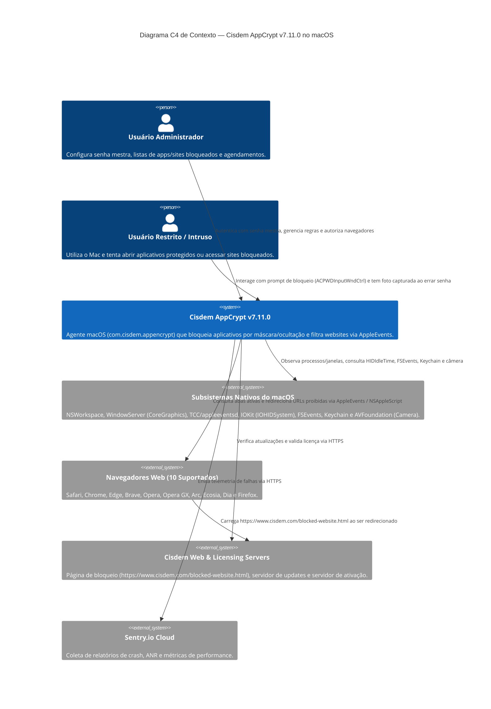

# Diagrama C4 — Nível 1: Contexto do Sistema

> Gerado pelo agente **Architect** (`doc_level = detalhado`, 🟢 CONFIRMADO).

```mermaid
C4Context
    title Diagrama C4 de Contexto — Cisdem AppCrypt v7.11.0 no macOS

    Person(admin, "Usuário Administrador", "Configura senha mestra, listas de apps/sites bloqueados e agendamentos.")
    Person(restricted_user, "Usuário Restrito / Intruso", "Utiliza o Mac e tenta abrir aplicativos protegidos ou acessar sites bloqueados.")

    System(appcrypt, "Cisdem AppCrypt v7.11.0", "Agente macOS (com.cisdem.appencrypt) que bloqueia aplicativos por máscara/ocultação e filtra websites via AppleEvents.")

    System_Ext(macos_subsystems, "Subsistemas Nativos do macOS", "NSWorkspace, WindowServer (CoreGraphics), TCC/appleeventsd, IOKit (IOHIDSystem), FSEvents, Keychain e AVFoundation (Camera).")
    System_Ext(browsers, "Navegadores Web (10 Suportados)", "Safari, Chrome, Edge, Brave, Opera, Opera GX, Arc, Ecosia, Dia e Firefox.")
    System_Ext(cisdem_web, "Cisdem Web & Licensing Servers", "Página de bloqueio (https://www.cisdem.com/blocked-website.html), servidor de updates e servidor de ativação.")
    System_Ext(sentry_cloud, "Sentry.io Cloud", "Coleta de relatórios de crash, ANR e métricas de performance.")

    Rel(admin, appcrypt, "Autentica com senha mestra, gerencia regras e autoriza navegadores")
    Rel(restricted_user, appcrypt, "Interage com prompt de bloqueio (ACPWDInputWndCtrl) e tem foto capturada ao errar senha")
    Rel(appcrypt, macos_subsystems, "Observa processos/janelas, consulta HIDIdleTime, FSEvents, Keychain e câmera")
    Rel(appcrypt, browsers, "Consulta abas ativas e redireciona URLs proibidas via AppleEvents / NSAppleScript")
    Rel(browsers, cisdem_web, "Carrega https://www.cisdem.com/blocked-website.html ao ser redirecionado")
    Rel(appcrypt, cisdem_web, "Verifica atualizações e valida licença via HTTPS")
    Rel(appcrypt, sentry_cloud, "Envia telemetria de falhas via HTTPS")
```
