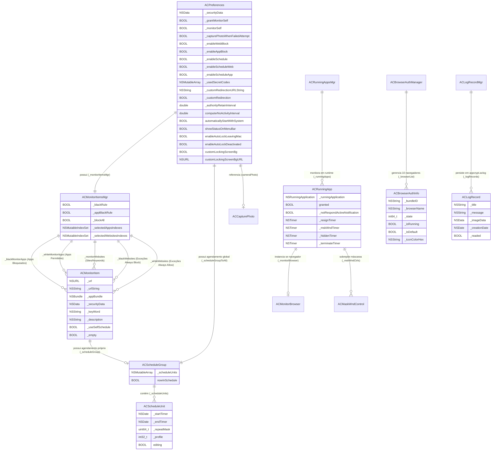

# Diagrama Entidade-Relacionamento Completo (Grafo de Objetos & Persistência)

> Gerado pelo agente **Architect** (`doc_level = detalhado`, 🟢 CONFIRMADO).

```mermaid
erDiagram
    ACPreferences ||--|| ACMonitorItemsMgr : "possui (_monitorItemsMgr)"
    ACPreferences ||--|| ACScheduleGroup : "possui agendamento global (_scheduleGroupToAll)"
    ACPreferences ||--o| ACCapturePhoto : "referencia (cameraPhoto)"

    ACMonitorItemsMgr ||--o{ ACMonitorItem : "_blackMonitorApps (Apps Bloqueados)"
    ACMonitorItemsMgr ||--o{ ACMonitorItem : "_whiteMonitorApps (Apps Permitidos)"
    ACMonitorItemsMgr ||--o{ ACMonitorItem : "_monitorWebsites (Sites/Keywords)"
    ACMonitorItemsMgr ||--o{ ACMonitorItem : "_blackWebsites (Exceções Always Block)"
    ACMonitorItemsMgr ||--o{ ACMonitorItem : "_whiteWebsites (Exceções Always Allow)"

    ACMonitorItem ||--o| ACScheduleGroup : "possui agendamento próprio (_scheduleGroup)"
    ACScheduleGroup ||--o{ ACScheduleUnit : "contém (_scheduleUnits)"

    ACRunningAppsMgr ||--o{ ACRunningApp : "monitora em runtime (_runningApps)"
    ACRunningApp ||--o| ACMonitorBrowser : "instancia se navegador (_monitorBrowser)"
    ACRunningApp ||--o{ ACMaskWndControl : "sobrepõe máscaras (_mskWndCtrls)"
    ACBrowserAuthManager ||--o{ ACBrowserAuthInfo : "gerencia 10 navegadores (_browserList)"
    ACLogRecordMgr ||--o{ ACLogRecord : "persiste em appcrypt.aclog (_logRecords)"

    ACPreferences {
        NSData _securityData
        BOOL _grantMonitorSelf
        BOOL _monitorSelf
        BOOL _capturePhotoWhenFailedAttempt
        BOOL _enableWebBlock
        BOOL _enableAppBlock
        BOOL _enableSchedule
        BOOL _enableScheduleWeb
        BOOL _enableScheduleApp
        NSMutableArray _usedSecretCodes
        NSString _customRedirectionURLString
        BOOL _customRedirection
        double _authorityRetainInterval
        double computerNoActivityInterval
        BOOL automaticallyStartWithSystem
        BOOL showStatusOnMenuBar
        BOOL enableAutoLockLeavingMac
        BOOL enableAutoLockDeactivated
        BOOL customLockingScreenBg
        NSURL customLockingScreenBgURL
    }

    ACMonitorItemsMgr {
        BOOL _blackRule
        BOOL _appBlackRule
        BOOL _blockAll
        NSMutableIndexSet _selectedAppsIndexes
        NSMutableIndexSet _selectedWebsitesIndexes
    }

    ACMonitorItem {
        NSURL _url
        NSString _urlString
        NSBundle _appBundle
        NSData _securityData
        NSString _keyWord
        NSString _description
        BOOL _useSelfSchedule
        BOOL _empty
    }

    ACScheduleGroup {
        NSMutableArray _scheduleUnits
        BOOL nowInSchedule
    }

    ACScheduleUnit {
        NSDate _startTimer
        NSDate _endTimer
        uint64_t _repeatMask
        int32_t _profile
        BOOL editing
    }

    ACRunningApp {
        NSRunningApplication _runningApplication
        BOOL granted
        BOOL _notRespondActiveNotification
        NSTimer _resignTimer
        NSTimer _mskWndTimer
        NSTimer _hiddenTimer
        NSTimer _terminateTimer
    }

    ACBrowserAuthInfo {
        NSString _bundleID
        NSString _browserName
        int64_t _state
        BOOL _isRunning
        BOOL _isDefault
        NSString _iconColorHex
    }

    ACLogRecord {
        NSString _title
        NSString _message
        NSData _imageData
        NSDate _creationDate
        BOOL _readed
    }
```
